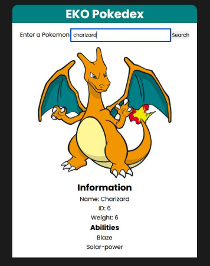

# eko-pokedex

View the project here: https://eko-develops.github.io/eko-pokedex/

> This project was created with HTML, CSS, and JavaScript. It consumes the PokeAPI by fetching data and displaying whichever pokemon the user enters.

---

### Table of Contents

- [Description](#description)
- [How To Use](#how-to-use)
- [References](#references)

---

## Description
The project was used mainly as a learning experience for using the fetch API included with as an interface with JavaScript.

#### Technologies

- HTML
- CSS
- JavaScript
- Fetch API - https://developer.mozilla.org/en-US/docs/Web/API/Fetch_API/Using_Fetch

---

[Back To The Top](#eko-pokedex)

## How To Use
The app is simple to use. Type in a valid pokemon name and the app will fetch the data from the PokeAPI and display the pokemon. If a pokemon could not be found, an error message will be displayed.

#### Installation
There's no need to install the project, you can view it here: https://eko-develops.github.io/eko-pokedex/

#### App Usage
View how to use.

---

[Back To The Top](#eko-pokedex)

## To do

- Work on the design
- Add get a random pokemon feature
- Add to favorites feature

---

[Back To The Top](#eko-pokedex)

## References

- How to Use Fetch - https://developer.mozilla.org/en-US/docs/Web/API/Fetch_API/Using_Fetch
- PokeAPI - https://pokeapi.co/

---

[Back To The Top](#eko-pokedex)